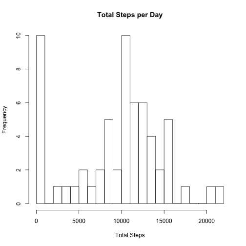

## Introduction
This is a report for the first peer-reviewed project for the Reproducible Research Class on Coursera.
It is assumed that the appropriate csv file is in the working directory.
The data is taken from collected activity monitoring data and has the following variables:
-steps: Number of steps taking in a 5-minute interval (missing values are coded as NA)
-date: The date on which the measurement was taken in YYYY-MM-DD format
-interval: Identifier for the 5-minute interval in which measurement was taken

## Loading and preprocessing the data
The first step is to load and process the data, along with appropriate libraries:

```r
setwd("/Users/alehnert/Documents/R")
library(ggplot2)
library(dplyr)
data<-read.csv("activity.csv")
```
## Mean total number of steps taken per day
Ignoring the missing values in the dataset:

1. Calculate the total number of steps per day

```r
TotSteps<-summarize(group_by(data,date),sum(steps,na.rm=T))
names(TotSteps)<-c("Date","Steps")
```

2. Make a histogram of the total number of steps taken each day:

```r
hist(TotSteps$Steps,breaks=20,main="Total Steps per Day", xlab="Total Steps")
```

 

3. Calculate and report the mean and median of the total number of steps taken per day

```r
mean(TotSteps$Steps)
```

```
## [1] 9354.23
```

```r
median(TotSteps$Steps)
```

```
## [1] 10395
```
## Average daily activity pattern

1.Make a time series plot of the average number of steps taken vs. 5-minute interval, averaged across all days

```r
Interval<-summarize(group_by(data,interval),mean(steps,na.rm=T))
names(Interval)<-c("ID","AvgSteps")
plot(Interval,type="l",xlab="Interval",ylab="Average Number Steps")
```

 

2. Which 5-minute interval, on average across all the days in the dataset, contains the maximum number of steps?

```r
Interval[which.max(Interval$AvgSteps),1]
```

```
## Source: local data frame [1 x 1]
## 
##    ID
## 1 835
```

## Imputing missing values
Note that there are a number of days/intervals where there are missing values (coded as NA).  
The presence of missing days may introduce bias into some calculations or summaries of the data.  

1. Calculate and report the total number of missing values in the dataset:

```r
sum(is.na(data$steps))
```

```
## [1] 2304
```

2. Fill in the missing values: I used the average value for that 5 minute interval in the other days 
3. I saved to the filled-in data set to the variable data2

```r
data2<-data
missing<-which(is.na(data$steps))
data2$steps[missing]<-Interval$AvgSteps[match(Interval$ID,data2$interval)]
```

4. Make a histogram of the total number of steps taken each day and Calculate and report the mean and median total number of steps taken per day.

```r
TotSteps2<-summarize(group_by(data2,date),sum(steps))
names(TotSteps2)<-c("Date","Steps")
hist(TotSteps2$Steps,breaks=20,main="Total Steps per Day", xlab="Total Steps")
```

 

```r
mean(TotSteps2$Steps) 
```

```
## [1] 10766.19
```

```r
median(TotSteps2$Steps)
```

```
## [1] 10766.19
```

Do these values differ from the estimates from the first part of the assignment? What is the impact of imputing missing data on the estimates of the total daily number of steps?  
Yes, both the mean and median shift upwards when the days with no data are filled in with average values. This is as expected.

## Are there differences in activity patterns between weekdays and weekends?
1. Create a new factor variable in the dataset with two levels – “weekday” and “weekend”. The data is now in the variable TS.

```r
TS<-mutate(data2,day=weekdays(as.Date(data2$date,"%Y-%m-%d")))
Weekend<-filter(TS,day=="Saturday" | day=="Sunday") # select weekend data
Weekend$working<-"weekend" # assign "weekend" to data subset
Weekday<-filter(TS,!(day=="Saturday" | day=="Sunday")) # select weekday data
Weekday$working<-"weekday" # assign "weekday" to data subset
TS<-rbind(Weekend,Weekday) # combine the weekend and weekday data
TS<-arrange(TS,date)  # sort by date
```

2. Make a panel plot containing a time series plotof the 5-minute interval and the average number of steps taken, averaged across all weekday days or weekend days.

```r
par(mfrow=c(2,1),mar=c(4.0,4.0,2.5,1.5))
# plot weekend data
WEInt<-summarize(group_by(Weekend,interval),mean(steps,na.rm=T))
names(WEInt)<-c("ID","AvgSteps")
plot(WEInt,type="l",xlab="Interval",ylab="Average Number Steps",main="Weekend")

# plot weekday data
WDInt<-summarize(group_by(Weekday,interval),mean(steps,na.rm=T))
names(WDInt)<-c("ID","AvgSteps")
plot(WDInt,type="l",xlab="Interval",ylab="Average Number Steps",main="Weekday")
```

 
